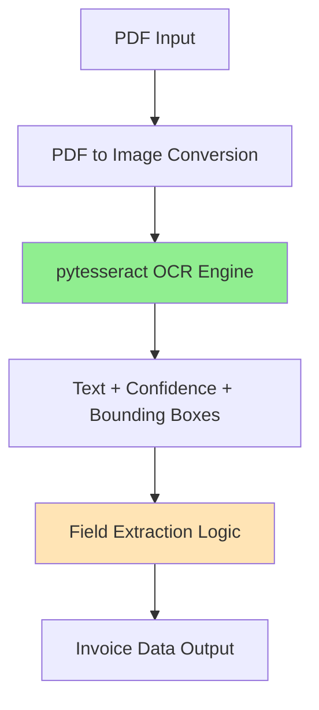

# OCR Functionality Fix Plan

**Project:** Billie MVP - Invoice Processing System
**Date:** 2025-12-31
**Status:** Planning Phase
**OCR Solution:** pytesseract (Cross-Platform)

---

## 1. Root Cause Analysis

### Current Implementation
The Billie MVP currently uses **PaddleOCR** for invoice text extraction, implemented in [`backend/ocr.py`](backend/ocr.py:1).

### Root Cause
| Issue | Details |
|-------|---------|
| **Import Failure** | `paddleocr` module is not installed (line 8 in [`ocr.py`](backend/ocr.py:8)) |
| **Platform Complexity** | PaddleOCR requires platform-specific installation with complex dependencies |
| **Dependency Chain** | Requires `paddlepaddle>=2.5.0` which has platform-specific builds |
| **macOS Specific** | PaddlePaddle has limited macOS support and requires specific installation methods |

### Current Graceful Degradation
The application handles OCR unavailability gracefully:
- Lines 28-33 in [`main.py`](backend/main.py:28) catch `ImportError`
- `OCR_AVAILABLE` flag controls functionality
- Returns empty extraction results when OCR is unavailable (lines 172-185)

### Impact
- Users cannot automatically extract invoice data
- Manual data entry required for all fields
- Reduces system utility and efficiency

---

## 2. Alternative OCR Solutions Evaluated

### Option 1: ocrmac (Apple Vision Framework Wrapper)

**Description:** Python wrapper for Apple's native Vision Framework, specifically designed for macOS.

| Criteria | Evaluation |
|----------|------------|
| **Installation** | `pip install ocrmac` - Simple pip install |
| **Dependencies** | Minimal - Uses built-in macOS Vision Framework |
| **macOS Support** | Native - Built specifically for macOS |
| **Performance** | Excellent - Uses Apple's optimized Vision framework |
| **Language Support** | Multi-language (uses Apple's recognition) |
| **Confidence Scores** | Provides confidence values |
| **Bounding Boxes** | Yes - Returns position information |
| **Active Development** | Yes - Last release Nov 2024 |
| **License** | MIT |

**Pros:**
- Zero external dependencies
- Native macOS integration
- Fast performance
- Simple installation
- Actively maintained

**Cons:**
- macOS-only (not portable to other platforms)
- Less documentation than mainstream options

---

### Option 2: pytesseract (Tesseract OCR Wrapper)

**Description:** Python wrapper for Google's open-source Tesseract OCR engine.

| Criteria | Evaluation |
|----------|------------|
| **Installation** | Two-step: `brew install tesseract` + `pip install pytesseract` |
| **Dependencies** | Tesseract binary + Python wrapper |
| **macOS Support** | Good - Well-documented macOS installation |
| **Performance** | Good - Mature, stable OCR engine |
| **Language Support** | 100+ languages |
| **Confidence Scores** | Limited - Requires `image_to_data()` for confidence |
| **Bounding Boxes** | Yes - With `image_to_data()` |
| **Active Development** | Yes - Mature project |
| **License** | Apache 2.0 |

**Pros:**
- Cross-platform (Linux, Windows, macOS)
- Well-documented and widely used
- Large community support
- Proven reliability

**Cons:**
- Requires system-level binary installation
- Two-step installation process
- Heavier than ocrmac
- May require additional language packs

---

### Option 3: EasyOCR

**Description:** Deep learning-based OCR library built on PyTorch.

| Criteria | Evaluation |
|----------|------------|
| **Installation** | `pip install easyocr` |
| **Dependencies** | PyTorch, OpenCV, NumPy (heavy) |
| **macOS Support** | Good - Works with pip |
| **Performance** | Good - Modern deep learning models |
| **Language Support** | 80+ languages |
| **Confidence Scores** | Yes |
| **Bounding Boxes** | Yes |
| **Active Development** | Yes |
| **License** | Apache 2.0 |

**Pros:**
- Simple pip install
- Modern deep learning approach
- Good accuracy
- Cross-platform

**Cons:**
- Heavy dependencies (PyTorch ~200MB+)
- Longer initial installation
- Higher memory usage
- May have Python version compatibility issues

---

### Option 4: Keep PaddleOCR (Fix Installation)

**Description:** Attempt to properly install PaddleOCR on macOS.

| Criteria | Evaluation |
|----------|------------|
| **Installation** | Complex - Requires platform-specific commands |
| **Dependencies** | paddlepaddle, numpy, shapely, etc. |
| **macOS Support** | Limited - May require specific Python versions |
| **Performance** | Good |
| **Language Support** | 80+ languages |
| **Confidence Scores** | Yes |
| **Bounding Boxes** | Yes |
| **Active Development** | Yes |
| **License** | Apache 2.0 |

**Pros:**
- No code changes required
- Already integrated in the system

**Cons:**
- Complex installation process
- Platform-specific issues
- Heavy dependencies
- May require virtual environment configuration
- Time-consuming to troubleshoot

---

## 3. Comparison Matrix

| Feature | ocrmac | pytesseract | EasyOCR | PaddleOCR |
|---------|--------|-------------|---------|-----------|
| **Installation Simplicity** | ⭐⭐⭐⭐⭐ | ⭐⭐⭐ | ⭐⭐⭐⭐ | ⭐ |
| **Dependencies** | Minimal | Medium | Heavy | Heavy |
| **macOS Native** | ✅ Yes | ❌ No | ❌ No | ❌ No |
| **Cross-Platform** | ❌ No | ✅ Yes | ✅ Yes | ✅ Yes |
| **Performance** | ⭐⭐⭐⭐⭐ | ⭐⭐⭐⭐ | ⭐⭐⭐⭐ | ⭐⭐⭐⭐ |
| **Confidence Scores** | ✅ Yes | ⚠️ Limited | ✅ Yes | ✅ Yes |
| **Bounding Boxes** | ✅ Yes | ✅ Yes | ✅ Yes | ✅ Yes |
| **Code Changes Required** | Medium | Low | Low | None |
| **Community Support** | ⭐⭐⭐ | ⭐⭐⭐⭐⭐ | ⭐⭐⭐⭐ | ⭐⭐⭐⭐ |

---

## 4. Recommended Solution

### Primary Recommendation: **pytesseract**

**Justification:**

1. **Cross-Platform:** Works on macOS, Linux, and Windows - provides flexibility for future deployment options.

2. **Mature & Reliable:** Tesseract OCR is a well-established, battle-tested OCR engine with proven reliability in production environments.

3. **Wide Community Support:** Extensive documentation, tutorials, and community resources available for troubleshooting.

4. **Good Documentation:** Well-documented API with clear examples for common use cases.

5. **Proven Invoice Processing:** Widely used for invoice and document extraction tasks.

6. **Active Maintenance:** Both Tesseract and pytesseract are actively maintained projects.

### Secondary Recommendation: **ocrmac**

If macOS-only deployment is confirmed and maximum performance is needed, ocrmac is a good alternative due to:
- Native macOS integration with Apple's Vision Framework
- Simpler installation (pip-only)
- Excellent performance on macOS

---

## 5. Implementation Plan (pytesseract)

### Architecture Overview



### Step-by-Step Implementation

#### Step 1: Install System Dependencies (macOS)

**Action:** Install Tesseract OCR binary via Homebrew
```bash
brew install tesseract
```

**Optional:** Install additional language packs if needed
```bash
brew install tesseract-lang
```

#### Step 2: Update Python Dependencies
**File:** [`backend/requirements.txt`](backend/requirements.txt:1)

**Actions:**
- Remove: `paddleocr==2.7.0.3`
- Remove: `paddlepaddle>=2.5.0`
- Add: `pytesseract>=0.3.10`
- Add: `pdf2image>=1.16.0` (for PDF to image conversion)

**Updated requirements.txt:**
```python
# Billie MVP - Invoice Processing System
# Backend Dependencies

# FastAPI and server
fastapi==0.104.1
uvicorn[standard]==0.24.0
python-multipart==0.0.6

# Database
sqlalchemy==2.0.23
aiosqlite==0.19.0

# Data validation
pydantic==2.5.0

# OCR
pytesseract>=0.3.10
pdf2image>=1.16.0
pillow==10.1.0

# CSV export
pandas==2.1.3

# Utilities
python-dateutil==2.8.2
```

---

#### Step 3: Rewrite ocr.py with pytesseract
**File:** [`backend/ocr.py`](backend/ocr.py:1)

**Actions:**
- Replace PaddleOCR import with pytesseract
- Update `InvoiceExtractor.__init__()` to configure pytesseract
- Modify `extract()` method to handle PDF to image conversion
- Use `image_to_data()` for confidence scores and bounding boxes
- Adapt field extraction logic to work with pytesseract output format
- Maintain existing confidence scoring interface

**Key Changes:**
```python
# Old import
from paddleocr import PaddleOCR

# New import
import pytesseract
from pdf2image import convert_from_path
from PIL import Image
```

---

#### Step 4: Test OCR Functionality
**Actions:**
1. Install system Tesseract: `brew install tesseract`
2. Install Python dependencies: `pip install -r requirements.txt`
3. Test with sample PDF invoice
4. Verify confidence scores are returned
5. Verify all four fields are extracted (vendor, date, total, invoice_number)
6. Test error handling for invalid PDFs
7. Verify Tesseract is accessible via command line: `tesseract --version`

---

#### Step 5: Update Documentation
**Files to update:**
- [`README.md`](README.md:1) - Update OCR section with Tesseract installation instructions
- [`backend/test_invoices/README.md`](backend/test_invoices/README.md:1) - Add testing notes

---

#### Step 6: Integration Testing
**Actions:**
1. Start backend server
2. Upload test invoice via web interface
3. Verify extraction results
4. Check confidence scores
5. Test edge cases (missing fields, low quality PDFs)

---

## 6. Code Structure Changes

### Modified Files

| File | Change Type | Description |
|------|-------------|-------------|
| `backend/requirements.txt` | Modify | Update OCR dependencies |
| `backend/ocr.py` | Rewrite | Replace PaddleOCR with pytesseract |
| `README.md` | Update | Add Tesseract installation instructions |

### No Changes Required

| File | Reason |
|------|--------|
| `backend/main.py` | Import handling already supports graceful degradation |
| `backend/models.py` | Data models unchanged |
| `backend/database.py` | Database layer unchanged |
| Frontend files | API contract unchanged |

---

## 7. Risk Assessment

| Risk | Likelihood | Impact | Mitigation Strategy |
|------|------------|--------|---------------------|
| **Tesseract not in PATH** | Medium | High | Add path configuration in ocr.py |
| **PDF to image conversion issues** | Medium | Medium | Add robust error handling |
| **Confidence score format differences** | Low | Low | Map pytesseract confidence to existing format |
| **poppler dependency for pdf2image** | Medium | Medium | Document poppler installation requirement |
| **Performance vs PaddleOCR** | Low | Low | Tesseract is generally performant enough |

---

## 8. Additional Installation Notes

### macOS System Dependencies
```bash
# Install Tesseract OCR engine
brew install tesseract

# Optional: Install additional language packs
brew install tesseract-lang

# Install poppler (required by pdf2image for PDF to image conversion)
brew install poppler
```

### Linux System Dependencies
```bash
# Ubuntu/Debian
sudo apt-get install tesseract-ocr
sudo apt-get install poppler-utils

# Optional: Install additional language packs
sudo apt-get install tesseract-ocr-eng
```

### Windows System Dependencies
1. Download Tesseract installer from: https://github.com/UB-Mannheim/tesseract/wiki
2. Install and add to PATH, or configure path in code
3. Install poppler for pdf2image

## 9. Testing Strategy

### Unit Tests
- Test OCR initialization
- Test PDF to image conversion
- Test field extraction patterns
- Test confidence scoring

### Integration Tests
- Test upload endpoint with real PDFs
- Test graceful degradation if OCR fails
- Test database integration

### Manual Tests
- Simple invoice (standard layout)
- Complex invoice (multiple items)
- Low quality PDF
- Missing fields invoice

---

## 10. Rollback Plan

If issues arise with pytesseract implementation:

1. **Immediate Rollback:** Revert `requirements.txt` and `ocr.py` changes
2. **Fallback Option:** Implement ocrmac as macOS-specific alternative
3. **Graceful Degradation:** System already handles OCR unavailability

---

## 11. Success Criteria

- [ ] OCR successfully extracts text from PDF invoices
- [ ] All four fields extracted: vendor, date, total, invoice_number
- [ ] Confidence scores returned for each field
- [ ] Installation completes without errors
- [ ] No breaking changes to existing API
- [ ] Performance acceptable (< 5 seconds per invoice)
- [ ] Error handling works for invalid PDFs

---

## 12. Future Considerations

### Potential Enhancements
1. **Multi-OCR Support:** Allow configuration to switch between OCR engines
2. **Template Matching:** Add invoice template detection for better accuracy
3. **Batch Processing:** Support processing multiple invoices
4. **Confidence Thresholds:** Make confidence thresholds configurable

### Multi-OCR Support
Consider implementing a factory pattern to support multiple OCR engines:
- pytesseract (default, cross-platform)
- ocrmac (macOS-optimized option)
- EasyOCR (deep learning alternative)

```python
# Future architecture example
class OCRFactory:
    @staticmethod
    def create(engine='pytesseract'):
        if engine == 'pytesseract':
            return PytesseractExtractor()
        elif engine == 'ocrmac':
            return OcrmacExtractor()
        elif engine == 'easyocr':
            return EasyOCRExtractor()
```

---

## 13. Estimated Effort

| Task | Effort |
|------|--------|
| Update requirements.txt | Minimal |
| Rewrite ocr.py | Medium |
| Testing | Medium |
| Documentation | Minimal |
| **Total** | **Medium** |

---

## 14. Approval

This plan is ready for implementation using pytesseract for cross-platform support. Please confirm if you would like to proceed with the implementation.